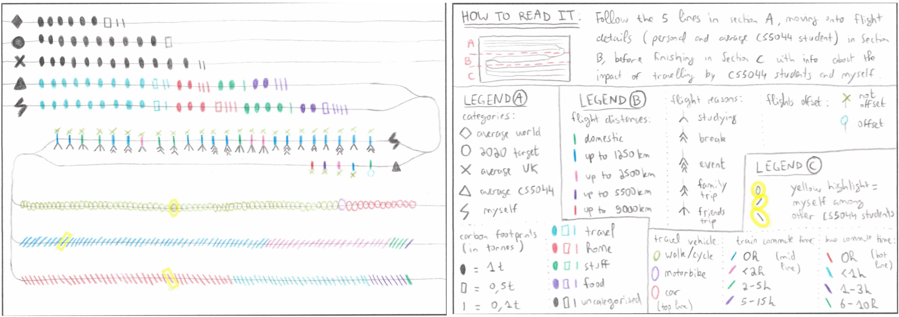

While taking the "Information Visualisation" class during my Master's in AI, one of our practicals consisted in calculating our 2019 carbon footprint (greenhouse gases, including CO2/CH4/N2O, that are built up from various everyday activities such as food, travel, living and shopping) via the [WWF carbon footprint calculator](https://footprint.wwf.org.uk/) and visualising it following the format of the [Dear Data project](http://www.dear-data.com/theproject) as a postcard. The front of postcard contains the visualisation and the back contains the key to read it:

The next section cover:

* How the different attributes from the carbon footprint calculator were visualised.
* If the visualisation follow the principles of expressiveness and effectiveness by [T. Munzner](https://www.taylorfrancis.com/books/mono/10.1201/b17511/visualization-analysis-design-tamara-munzner).
* A discussion of the visualisation's advantages and limitations.

 

<!--more-->

# Table of attributes and how they were visualised

| Attribute                                                                                                                                                                  | Attribute Type         | Visual Variable                                                                                                                                                                                                                                           | Expressive (Yes/No)                                                             |
| -------------------------------------------------------------------------------------------------------------------------------------------------------------------------- | ---------------------- | --------------------------------------------------------------------------------------------------------------------------------------------------------------------------------------------------------------------------------------------------------- | ------------------------------------------------------------------------------- |
| Carbon footprint categories                                                                                                                                                | Categorical            | Shapes to distinguish between average world citizen (diamond), average UK citizen (cross), average CS5044 student (triangle), 2020 world target (circle), and myself (thunder).                                                                           | Maybe: shapes all found in same place (A), but also used later (section B).     |
| Position on common scale: parallel lines used to directly compare the differences between each scale.                                                                      | Yes\*                  | N/A                                                                                                                                                                                                                                                       | N/A                                                                             |
| Carbon footprint amount (in tonnes)                                                                                                                                        | Ordered (quantitative) | Shapes for various weights (solid oval for 1t, hollow rectangle for 0.5t and line for 0.1t), as shown in Appendix B.1.                                                                                                                                    | Yes, as it concentrates on relaying the amount in tonnes.                       |
| Position to order each parallel line representing a scale from smallest to largest carbon footprint. Allows the relative impacts to be directly compared without counting. | Yes\*                  | N/A                                                                                                                                                                                                                                                       | N/A                                                                             |
| Carbon footprint amount breakdown                                                                                                                                          | Categorical            | Colour hue for breaking down into the four categories (travel in light blue, home in red, stuff in green, and food in purple) or none (uncategorised in dark grey) (see Appendix B.2).                                                                    | Yes, as it clearly breaks the footprint down into four categories.              |
| Method of travel                                                                                                                                                           | Categorical            | Shapes to allow each answer to the selected survey questions regarding method of travel to be distinguished from one another (plane as lines, car/motorbike/walking as circles, train as right-tilted line, bus as left- tilted line) (see Appendix B.3). | Yes, as it relays all travel information.                                       |
| Flight distance                                                                                                                                                            | Ordered (quantitative) | Colour hue to differentiate between the various flight distances (green for domestic, blue for up to 1250km, pink for 2500km, purple for 5500km and red for 9000km).                                                                                      | Yes\*                                                                           |
| Flight reason                                                                                                                                                              | Categorical            | Shapes to represent the different reasons for each flight (studying, break, event, family trip, friends trip). Part of new data set used as the extension to the practical – see Appendix B.4).                                                           | Yes\*                                                                           |
| Flight order                                                                                                                                                               | Ordered (ordinal)      | Position along the line, starting from oldest to most recent flights (ranging from Feb-2019 to Feb- 2020).                                                                                                                                                | Yes\*                                                                           |
| Flight offset                                                                                                                                                              | Categorical            | Shapes to represent whether the flight was offset or not (circle for offset flights and cross for not- offset flights). Can be distinguished from other similar shapes as they are attached to the lines representing flights.                            | Maybe: needed to approximate offset for average CS5044 student (see Appendix B) |
| Type of vehicle                                                                                                                                                            | Categorical            | Colour hue to represent the type of vehicle (walk in green, car in red and motorbike in purple).                                                                                                                                                          | Yes\*                                                                           |
| Time spent on commute                                                                                                                                                      | Ordered (ordinal)      | Colour hue to represent the time slices of hours spent on bus/train commutes.                                                                                                                                                                             | Yes\*                                                                           |
| Number of occurrences for each travel method                                                                                                                               | Ordered (quantitative) | Shape enumeration to count the number of people for each travel method and time spent on commute (using the shapes mentioned in the previous row).                                                                                                        | Yes, as it accurately displays number of occurrences.                           |
| My contribution to travel among CS5044 students                                                                                                                            | Ordered (ordinal)      | Colour hue to stand out among all the uses for each commute method (digitally highlighted in yellow as the university scanners could not properly pick up the colour).                                                                                    | Yes\*                                                                           |

 

# T. Munzner's principles of expressiveness and effectiveness

## Expressiveness 

The principal of effectiveness is followed as the chosen visual variables express all of the data (Appendix B). Additionally, unordered data is not visualised in a way that implies ordering, and vice versa.

## Effectiveness 

Munzner breaks down the principles of effectiveness into the following categories [2]:

### Accuracy 

The visualisation follows Cleveland and McGill’s experiments, depicting how “aligned positions against a common scale” yields maximum accuracy [3]. At the top of the Munzner ranking of visual variables effectiveness, “position on common scale” (ordered attributes) and “colour hue” (categorical attributes) are found and both used in the visualisation. However, “shape” is ranked as the least effective, therefore partially violating the principle as it is used repeatedly in the visualisation.

### Discriminability 

Data encoded using identical visual variables does not exceed five bins, thus following this principle. This is reinforced when the visualisation is read by section (A/B/C) and not as whole. If the visualisation/legend were not separated into three sections, the visualisation might violate this principle through the considerable use of different hues and shapes.

### Separability 

Attributes using shapes and hues often interfere with one another in this visualisation, but both the use of position along the lines and the detailed legend help follow the principle. Additionally, the poor combinations stated by Munzner (hue/position, size/hue) are not used.

### Popout 

This principle is followed through the use of hue to distinguish my own travel habits among the CS5044 students.

### Grouping 

The data is grouped by being placed along lines which encode carbon footprint scales, and the visualisation is divided into three distinct sections, thus following the grouping principle.

 

# Discussion

The main advantage of the visualisation is that it always directly compares my personal footprint to others’ in a linear fashion, allowing readers to start with the general footprint comparisons, followed by personal flights in the past year in relation to the average CS5044 student, and ending with personal travel habits compared to CS5044 students. Another advantage is the use of shape enumeration to accurately relay information e.g. the exact carbon footprint in tonnes, the number of flights, the number of students travelling by car/motorbike/on foot, and the hours spent on train/bus commutes, can all be precisely counted in the sketch. Additionally, the visualisation is sketched in a combined view rather than separating the information being visualised.

The main limitation comes with the amount of detail generated by the use of shapes to enumerate the amount of carbon footprint in tonnes or the travel habits of the CS5044 students, which may be difficult to read as it requires multiple cognitive skills (attention, perception and processing) due to potentially high interference. Additionally, the large number of shapes/hues could prove difficult to read for some, and the visualisation does not always follow Munzner's definition of effectiveness.

In comparison to the WWF visualisations (see Appendix A), the sketch conveys more detailed information into a single view, whereas the WWF separates the overall carbon footprint and the lifestyle aspects breakdown. However, the WWF uses powerful visual variables in simple manners to display the information effectively, making use of size and shape for the actual footprints, as well as position and colour hues for additional clarity, whereas more advanced combinations are used in the sketch.

This exercise taught me to force myself to brainstorm new visualisations through different visual variables in order to weight all options available to me. It also taught me that in the context of information visualisation, readability is more important than aesthetics, and to not be afraid of starting over until a visualisation that I am satisfied with is achieved. Finally, it also taught me that I need to fly planes less often (or at least try to offset my flights).

You can read the full report, which includes the data and initial drafts, by [following this link](https://www.icloud.com/iclouddrive/054oM8WR0BFGdIEtAfUPWSs3Q#report).