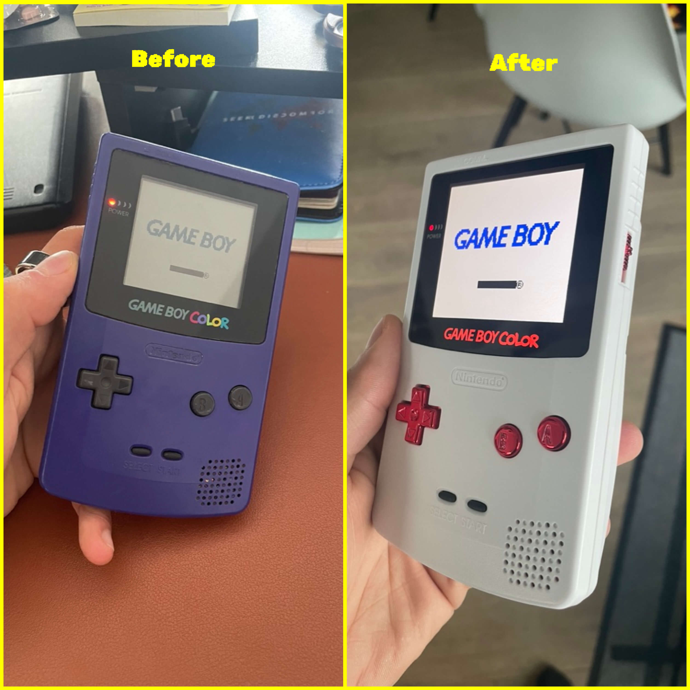

Back in July, I bought a GameBoy Color for £10, and decided to mod it so I could emulate my youth and play Pokemon Crystal during an upcoming 1-month trip.

However, I had no experience modding consoles, and no soldering experience. But thanks to my partner and to YouTube, I opted for the best mods I could find that I had confidence I could complete without losing the console. Here is a before & after of the project:

<!--more-->

The console works great, looks great and provided a lot of fun hours of gameplay so far! Here is a list of all the mods I installed:

* IPS Laminated screen replacement
* Shell replacement
* Speaker replacement
* Custom-made stickers
* Game cartridges: replaced batteries (to avoid losing save files)

Future modifications that I still want to conduct in the future are USB-C charging and a battery level indicator (it died on me in the middle of a flight, but thankfully I had planned for extra batteries). I also want to mod an broken GameBoy Advanced SP that I bought at the same time!