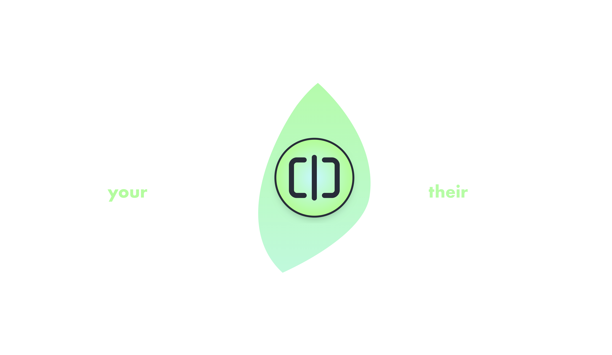
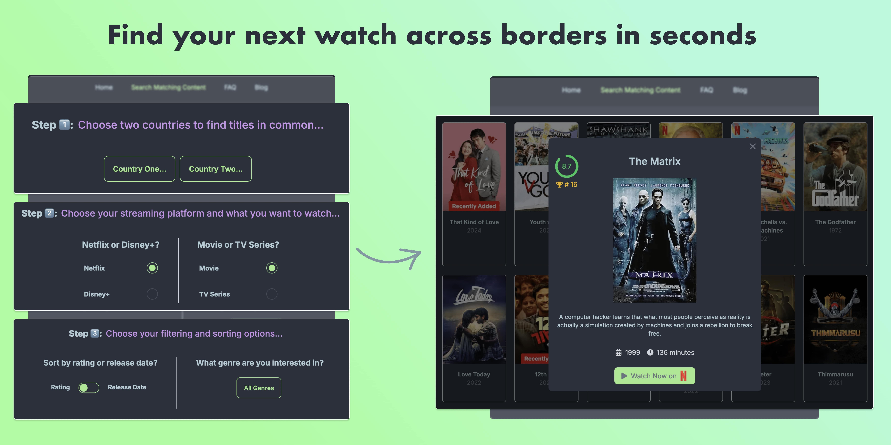

If you’ve been reading this blog, you know my hobbies often shift between sport challenges, gaming, stamp collecting, data visualisation and many more. But lately, I’ve been devoting some of my free time diving into the world of launching small software startups, a concept you might be familiar with from @marc_louvion’s Shipfast, or from @levelsio or @dannypostmaa on X. This shipfast philosophy of prioritising speed and execution over perfection is what led to the creation of my latest project, [GlobeFlix](https://www.globeflix.app/?ref=retroblog).

<!--more-->

# The Idea Behind GlobeFlix

GlobeFlix was born from a problem I’ve experienced (and maybe you have too): trying to watch a movie or TV series online with my partner, a friend or a family member who are in another country.

Thanks to streaming platforms like Netflix or Disney+, we are spoiled for choice - but regional licensing agreements mean that what’s available in one country might not be available in another (you can read more about the topic via this article: [Why Netflix Has Different Movies and TV Shows Across Different Countries](https://www.globeflix.app/blog/why-netflix-catalogue-different-each-country?ref=retroblog))! Finding something we can both watch often turned into a frustrating guessing game, and I experienced this first hand when trying to find something to watch in common with my partner who was in Egypt while I was in the UK back in 2021.

That’s where GlobeFlix comes in. It’s a web app designed to help users find the intersection of movies and TV series available in two countries. With features like advanced search, filtering, and sorting tools, it’s designed to facilitate finding something to watch!

# From Idea to MVP in Record Time

I started working on GlobeFlix back in May, using the ShipFast boilerplate to accelerate the process. The goal was to build a minimum viable product (MVP) as quickly as possible, focusing on the core, while all other features such as emails, payments, logins, database, SEO and style were taken care of by the boilerplate.

Here’s how I approached it:

1. I defined the core problem and designed a solution around it: an app that searches for titles in common between two countries
2. I validated by running a user survey with 106 relevant participants (partners or friends who watch content remotely over long distances) on Prolific, confirming that this was a problem worth solving, and giving us a clearer idea of the core functionality we needed to implement.
3. I found data that was accessible through an affordable API (there is a more expensive option, but will only use it if we get enough users) and researched similar products. I found that there are other ways to get the information GlobeFlix offers, but they involve either very outdated/clunky apps with poor UI/UX, or knowing how to use an API manually.
4. I finally built the app, which involved wrapped the API in an elegant web app via the boilerplate. The tech stack uses NextJS with Typescript. I elected Stripe for payments, Mailgun for emails, NextAuth for user authentication and MongoDB for my database.
5. Iterating. The first version of GlobeFlix wasn’t perfect - and that’s okay. It still isn’t perfect today either. But by getting it out there quickly, I’ve been able to gather feedback and improve incrementally as I share it across forums such as Reddit or Discord, and share its development on X/Twitter.

# Lessons Learned

Working on GlobeFlix has been an exciting journey, and it’s taught me a lot about balancing ambition with practicality:

- Boilerplates are great to get started, but I needed to invest time to make it fit GlobeFlix. They only get you three quarters of the way there, you need to push yourself to get it 100% there.
- SEO is extremely important to get organic traffic, and I wish I had built the app with that in mind rather than trying to improve SEO afterwards.
- Feedback is Gold, and GlobeFlix’s early testers have been invaluable in shaping the app (features, UI, landing page content).
- Done is Better Than Perfect: GlobeFlix is far from flawless, but it’s functional—and that’s what matters most.

# What’s Next?

Now that the core functionality of GlobeFlix is completed, I have paused development of new features. There is still so much I want to add, such as movie search, wish listing, or VPN perks, but I need to focus on getting more customers first. At the moment of writing, I am sharing GlobeFlix to relevant users rather than other creators, and am planning to launch on platforms such as Product Hunt. I also have my eyes set on future ideas, which I will start developing in parallel to GlobeFlix (as per the Shipfast ideology).

If you’re curious about [GlobeFlix](https://www.globeflix.app/?ref=retroblog) or want to follow along with my other indiepreneur ventures, stay tuned via my [X/Twitter feed](https://x.com/Adamouization) or my [IndiePage profile](https://indiepa.ge/adamj).