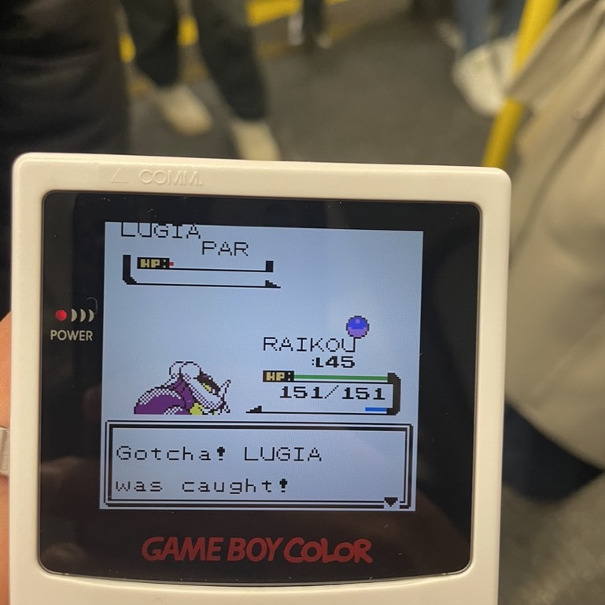

After playing Pokémon Crystal on my modded GameBoy Color for the past months, I wanted to share some of the maths that made me appreciate this classic even more. 

## Bugged Catch Rates of legendary Pokémon Lugia

I play most when travelling, commuting or on vacation. After almost finishing in the span of 3 months, I reached the point where I needed to catch one of the legendary Pokémon: [Lugia](https://pokemondb.net/pokedex/lugia). However, I knew from my **vast** experience playing Pokémon since the age of 7 that they are really hard to catch without a Master Ball (for context, a Master Ball guarantees a 100% success rate - but I had already used it for another Pokémon, and you only get one per game). The ideal strategy consists of bringing the enemy to 1 health point remaining, alter its status (e.g, to asleep, frozen, paralysed, burned or poisoned) and use Ultra Balls (the best one available after the Master Ball) to increase the catch rate per attempt. 

So that was my approach, but little did I know that a bug unknown to me at the time would make it much harder to catch Lugia...

<!--more-->

It took quite a bit of "grinding" on multiple tube rides to/from the office to finally catch Lugia. But it took much longer than I expected and I seemed to be particularly unlucky each time I tried. So my curiosity pushed me to do some research about the probabilities of me catching this Pokémon as my approach didn’t seem very efficient. After some Google searches, I found out how the catch rate is calculated for all Pokémons in the game with [this formula](https://www.dragonflycave.com/mechanics/gen-ii-capturing):

$$
X = max\bigg(\frac{(3M - 2H) \times C}{3M}, 1\bigg) + S
$$

Where:

- `M` = maximum health points
- `H` = current health points
- `C` = modified capture rate ($ \times 1 $ for normal Poké Ball, $ \times 1.5 $ for Great Ball and $ \times 2 $ for Ultra Ball)
- `S` = current status ($ +10 $ for *Asleep* and *Frozen* statuses, else $ +0 $)

This leaves us with the following catch rates per attempt, which are compiled using [this calculator](https://www.dragonflycave.com/calculators/gen-ii-catch-rate):

|  | Poké Ball | Great Ball | Ultra Ball |
| --- | --- | --- | --- |
| 100% health - No status | 0.781% | 0.781% | 1.05% |
| 100% health - Asleep/Frozen | 4.688% | 4.688% | 4.956% |
| 1% health - No status | 1.172% | 1.563% | 2.344% |
| 1% health - Asleep/Frozen | 5.078% | 5.469% | 6.25% |

 

However, if you have an acute eye for detail, you’ll notice that this table doesn’t include statuses like Poisoned, Burned or Paralysed. These are meant to have a value of `S=5` added in the formula, but a bug causes them to not be taken into account, so it's `S=0`! It was therefore a surprise to learn that to increase the catch rate, the status needs to be either asleep or frozen, else the catch rate remains very low. And I didn’t know that until **after** I caught Lugia in way more attempts than I wished.

In an ideal scenario with optimal conditions (which I thought I was close to, but in reality was not), Lugia would be down to exactly 1 health point and either asleep or frozen. In this scenario, I would need only 11 balls for a 50% chance of catching it, and 47 balls for 95% chance.

In reality, I could only get Lugia "close enough" to 1 health point (around 1%) and had just 30 Ultra Balls along with two Pokémons that could paralyse it, not make it fall asleep, which we now know is useless as it causes `S` to remain at 0. So my chances of catching Lugia were more than 3 times lower than what I believed they were, and I probably could have caught it the first two tube rides.

I did do a silent solo celebratory dance when I eventually caught Lugia while riding the London tube, and snapped a quick picture (see top of the article).

## Markov Process and Bayes’ Theorem for catching the legendary dogs

I could write about the most efficient technique for catching the legendary dogs, but there is already a great guide on Reddit that explains how to catch them and details how it works using Markov Processes and Bayes’ Theorem to explain the numbers behind the strategy. I invite you to give it a read here: [https://www.reddit.com/r/pokemon/comments/7c2jlm/how_to_catch_raikou_suicune_and_entei_a/](https://www.reddit.com/r/pokemon/comments/7c2jlm/how_to_catch_raikou_suicune_and_entei_a/).