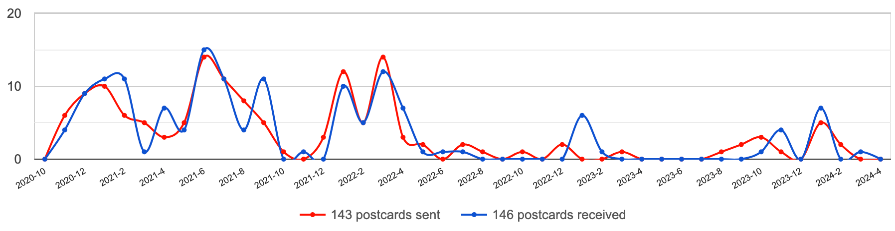
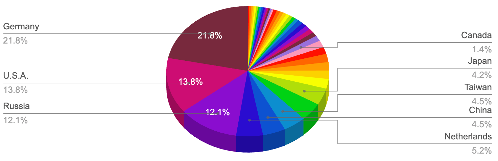

As stamp collector, I wanted to find a way to get more stamps and use nice ones in postage. Therefore, during the Covid pandemic in 2020, I stumbled upon PostCrossing and gave it a go to attempt getting more stamps to add to my collection. Postcrossing ended up becoming a very enjoyable hobby, at first during lockdown, and more recently when travelling to another country as it allows to discover their postal services and stamps from the POV of a local. Today, I have sent enough postcards to almost cover the distance to the Moon and back!

<!--more-->

For context, Postcrossing consists of a project whereby for every postcard you send to a stranger, you get one back from a different stranger around the globe. The system is facilitated by [Postcrossing.com](http://Postcrossing.com), which assigns you an address at random from another user. Once that user received your card (which is done via a unique ID you write on the card), your address is then sent to another user who will send you a card, and the cycle repeats.

Since I started in October 2020, I have sent 143 postcards and received 146 via Postcrossing.com. This would place as the #1 Postcrosser from Monaco, but I have moved to the UK in 2021 and I am way behind on the British Postcrossers. Today I usually only post when travelling abroad or back home:

Thanks to Postcrossing, I extended my stamp collection with some very unique new additions to my collection. The most notable one was this [stamp made out of toilet paper in Austria in 2020](https://www.ncbi.nlm.nih.gov/pmc/articles/PMC9433919/) in reference to the hoarding of toilet paper rolls that occurred during the Covid-19 pandemic.

Stamps aren’t the only cool thing I got from this experiment, as I also got plenty of data to pull some interesting stats from: 

## Distances
  - Card I sent that travelled the **furthest**: [MC-790](https://www.postcrossing.com/postcards/MC-790), which travelled from Monaco to Australia for a total of 16455 km!
  - Card I sent that travelled the **closest**: [MC-721](https://www.postcrossing.com/postcards/MC-721) travelled only 88km to a neighbouring town to Monaco in Italy
  - **Total distance** that all my sent cards covered: 545,422km, which is enough to travel the circumference of Earth 13.6 times!

## Travel time
  - Card I sent that took the **most days** to arrive: [MC-787](https://www.postcrossing.com/postcards/MC-787), which took a whole 7 months and 25 days to reach its destination. The delay was likely due to the card being lost, as excluding this outlier, the average time for cards I sent to arrive to the Netherlands is ~8 days.
  - Card I sent that took the **least days** to arrive: MC-718 took only 2 days! In a day and age where we are used to next-day Amazon Prime deliveries, this is remarkable as it means this non-priority card was picked up on the day and made its way fast enough to be in the mailman’s bag the day after next.
  - Country from which cards take the most time to arrive to me: China, from which I received 7 cards, takes on average 82 days to arrive to me (vs 54 days for to send to China).

## Countries
  - Country I sent the most cards to and received the most cards from: Germany, to which I sent 18.2% of my card to (26 in total) and received 25.3% of my cards from (37 in total). This is somewhat surprising as it’s the country with the 5th most members, with less than half the members from Russia.
  - Country I sent the least cards to: Austria, Belgium, Slovenia, Hong Kong, Latvia, Bulgaria, Hungary, Australia, Ukraine, UK, Sri Lanka, Spain, Brazil, Indonesia, Poland, Kazakhstan and Turkey. This is likely due to the relatively small sample size compare to other members who have sent thousands of postcards.

If you haven’t yet, I highly encourage you to give Postcrossing a go! If you do, leave me a message so we can send each other a postcard.