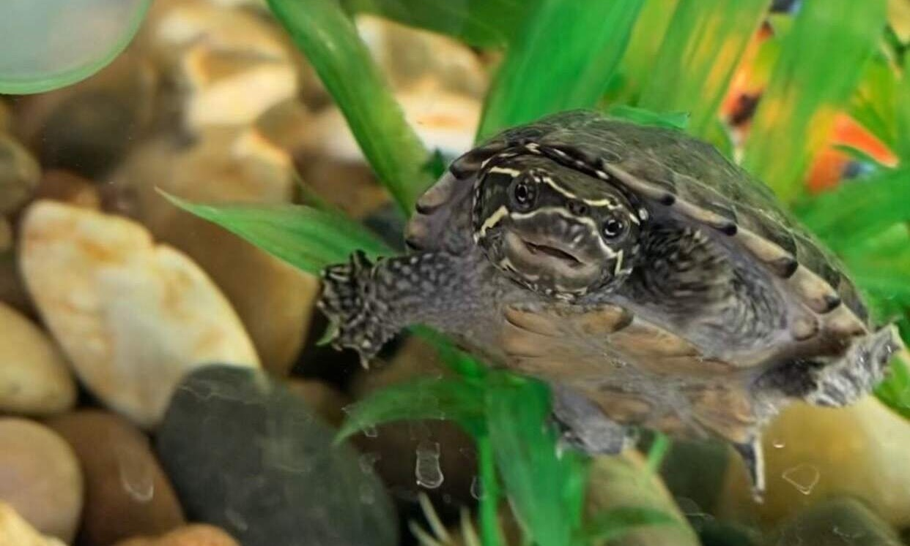
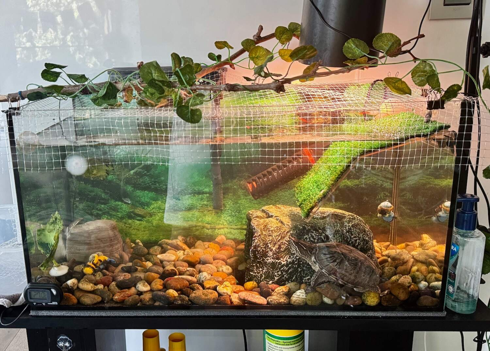

Caring for a turtle isn’t just “set up a tank and watch it swim”. Over the past 3 years, I’ve discovered that these little dinosaur-looking reptiles can be surprisingly delicate, and small mistakes can really add up fast. Below are some tips I learned along the way with Burtle, and that I wish I knew from day 1.

<!--more-->

1. **Know your species.** Care parameters, such as water depth, basking temperature, water temperature, diet, etc. can all vary widely even between closely related turtles. So research your exact species, not “turtles” in general. In the case of Burtle, she is a common musk turtle (also referred as [Sternotherus odoratus](https://en.wikipedia.org/wiki/Sternotherus_odoratus)).
2. **Buy the *adult-size* tank first if you can.** A large setup may sting financially at first, but upgrading later costs more money and stress for everyone involved (you and the turtle). For Burtle, we got a 54L tank, which is OK for the first years, but we already want to switch to a much larger one more than double in size, which means we’ll also need more powerful filters, heater, etc.
3. **Track health every day at first.** Observing lethargy, weird swimming patterns, unusual colours on shell (top and under), lack of basking or loss of appetite usually means something is wrong. So trust your gut instinct and investigate, and call a reptile vet quickly if in doubt. 
4. Which leads me to tip #4: **secure a reptile vet.** Exotic-pet vets are rare, so find one near you, especially for juveniles turtles. Burtle has regular yearly check-ups, and we went twice when she was ill. Optional: get a reptile pet insurance.
5. **Don’t gender a hatchling.** Sexing is literally guesswork until the turtle is at least a year old. So save yourself the false certainty. We gendered Burtle as male for a year, then the vet said she’s a female …
6. **Water-change routine.** Minimum: 25 % each week and 75 % every month, plus water testing every time (before and after) and conditioners added every time (I use water safe, ph down, algae remover and nitrate remover with Burtle).
7. **Real plants over plastic plants**. Plastic plants may seem like a good idea when first setting up a tank. But you’ll soon realise that your turtle might confuse these fake plants for food. As soon as we noticed this, we replaced all of them with real plants, which are also a source of extra food and entertainment for Burtle.
8. **Plants are disposable décor.** Most turtles treat live plants as salad; add them only if you’re fine with losses. Burtle ate all the nice plants we got her (which is good!)
9. **Accept the algae.** The sooner you do, the better. Algae is a natural part of an aquarium. We used to fight it all the time to keep the tank “clean”. But it always came back, so we accepted it. Algae feels natural in tank now, especially with real plants, and since it’s been growing to a healthy amount over time once we learned to control it. So just keep it under control, and regularly test the water levels!
10. **Watch the “big 3” behaviours: basking, swimming, eating.** If any disappear, first check water quality, temps, and diet before jumping to conclusions.
11. **Feed in a separate container from day one.** It keeps the main tank cleaner, the water quality remains good for longer, and it teaches the turtle that handling = food, not stress. Which means you can interact with your turtle more often (we often let Burtle walk around, and she loves shell scratches when we hold her).

For more bite-sized care tips and tank-cleaning examples, check out Burtle’s [YouTube channel](https://www.youtube.com/YourChannelHere) and [TikTok](https://www.tiktok.com/@YourHandleHere) from when she was just a few months old. We don’t upload anymore, but the videos are still there!

