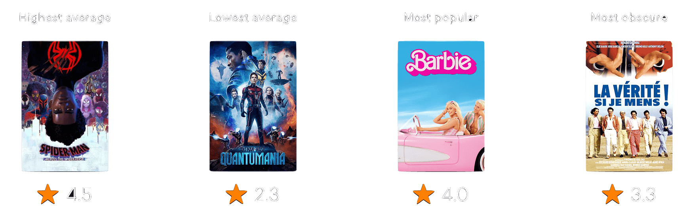

In 2023, I watched less movies than I did I previous years (likely due to the good weather and Covid not being a thing anymore). I watched a total of 68 movies (110 in 2022, 123 in 2021 and 137 in 2020), which amounted to:
* 138.1 hours watch time
* 5.7 movies on average per month (1.3 per week)

<!--more-->

I watched more movies on Sundays and Mondays, and the least on Thursdays:

Of all the movies I watched, "Spider-Man: Across the Spider-Verse" was the highest rate on Letterboxd, whereas "Ant-Man and the Wasp: Quantumania" was the lowest rated:

Here are some extra stats about the movies I watched in 2023:
* 38% of these movies were released in 2023
* 90% were watched with my partner
* 47% were comedy movies, 40% drama, 25% adventure and 22% sci-fi (movies can have multiple genres)
* 90% were from the USA
* 16% were re-watches
* 26% were watched [in the cinema](https://letterboxd.com/adamouization/list/my-2023-cinema-viewings/) this year.

Since 2019, I have been tracking every movie I watched via Letterboxd, an online social cataloguing service. You can add me here: https://letterboxd.com/adamouization/. You can see the full year in movie here: https://letterboxd.com/adamouization/year/2023/. 