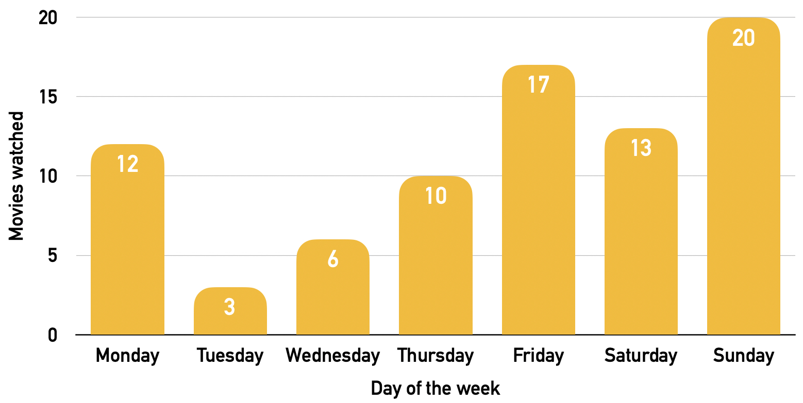

I watched more movies in 2024 than I did in 2023, but went less to the cinema (13 times in 2024 vs 18 times in 2023), likely due to more interesting movies releasing in 2023. But I did go watch Dune 2 twice at the BFI IMAX (why not?)

<!--more-->

In total, I watched movies for 163.2 hours in 2024, averaging 6.8 movies per month (1.5 per week). Of these 81 movies:

* 28.4% were 2024 releases
* 48% had the genres *adventure*, 44% *comedy* and 32% *action* 
* 18.5% were re-watches, which mainly come from re-watching old collections of movies or catching up for new mogies, including:
  * Wes Anderson's Short Roald Dahl Movies
  * Kung-Fu Panda collection (in anticipation of Kung-Fu Panda 4)
  * Mad Max collection of new movies (in anticipation of Mad Max: Furiosa)
  * Inside Out (in anticipation of Inside Out 2)
  * Moana (in anticipation of Moana 2)
  * Paddington 1 & 2 (in anticipation of Paddington 3)
  * Gladiator I (in anticipation of Gladiator II)
  * All Harry Potter movies

Similarly to previous years, I watched more movies on weekends (peaks on Sundays and Fridays, and the least on Tuesdays rather than Thursdays (2023):

Since 2019, I have been tracking every movie I watched via Letterboxd, an online social cataloguing service. You can add me here: https://letterboxd.com/adamouization/. And you can also see the full year in movie here: https://letterboxd.com/adamouization/year/2024/. 