After diving into the world of triathlon last year and competing in both the [London T100 Olympic Triathlon](https://adamouization.github.io/2024/07/28/first-triathlon/) and the Dorney Sprint Triathlon, I decided to challenge myself with the IronMan 70.3 distance for 2025. I set an ambitious goal of completing it in under 6 hours.

<!--more-->

---

# Motivation

I've always wanted to complete this distance: it was practically a childhood dream. Watching the IronMan 70.3 Monaco every year from my balcony was in the back of my mind when I began this journey of endurance running and triathlon back in 2022.

Why Swansea rather than Nice (closest race to my hometown) or somewhere more picturesque? I wanted a local UK race, and we have three 70.3 options: Bolton, Weymouth, and Swansea. Bolton lacked a flat run course, and Weymouth conflicted with an event I couldn't miss. So I chose Swansea, despite it having the highest bike elevation (1106 m). I welcomed the challenge!

---

# Goals

I set myself the ambitious goal of completing in under 6 hours. With a flat course (like I had for my [previous triathlons](https://adamouization.github.io/2024/07/28/first-triathlon/)), this would have been more of an achievable target. But studying the bike layout and the results from previous year, I could see that keeping a steady 30kph despite all that elevation would not be easy. But I thought it was a good goal to work towards! I also set myself goals for each leg of the race to improve in all areas.

Here were my goals for IM70.3 Swansea:

- Overall finish under 6 hours
- Individual legs:
    - Swim under 40 minutes
    - Bike under 3 hours
    - Half-Marathon under 2 hours

---

# Budget

By the time 2025 rolled up, I already knew that I loved triathlon thanks to [last year's races I participated in](https://adamouization.github.io/2024/07/28/first-triathlon/), so I decided to invest a bit more in the sport. I mainly invested in upgrading the bike, getting higher-end gear and getting a structured training plan. Here were my main upgrades budget-wise for 2025:

- Bike upgrades:
    - Professional bike fit with the guys over at [Personal Bike Fit](https://personalbikefit.com/), which allowed me to find the optimal position on the bike (a combination of an aggressive aerodynamic position and comfort so that I can hold it for +3 hours).
    - Aero tri bars (part of the bike fitting process) to go faster on the straights while pushing the same power.
    - A pair of deep carbon wheels (50mm Hunt Wheels) with thicker tires (Pirelli P-Zero) to go also go faster.

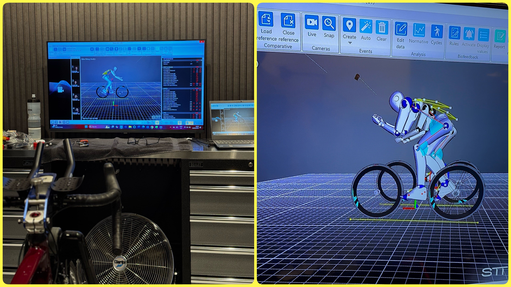

- Gear upgrade: aerodynamic race wear to save some extra watts: Castellini Trisuit + aero socks
- Training Plan:
    - A structured training plan by Phil Mosley at MyProCoach (with build, recovery, peak and taper phases).
    - A Training Peaks subscription to track my progress and organise my workouts.
    - A second-hand Garmin Fenix 5 watch to make use of the plan's structured workouts while running/swimming.
- A heart rate monitor for more accurate readings (than on the wrist) that can capture heart rate spikes more accurately and is generally more precise.

Overall, here is the distribution of where the budget went, which is similar to 2024, but with more budget on travel and accommodation as the race was abroad, and on race expense as the fees for an IronMan are higher.

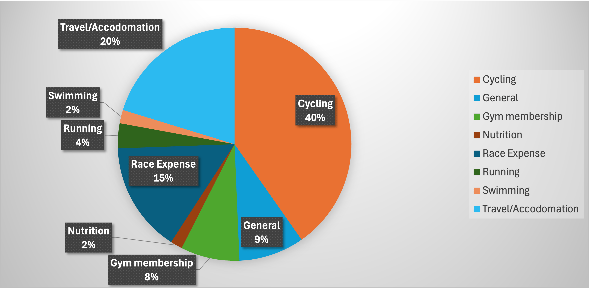

---

# Pre-training changes from last year

I implemented some changes before even starting the training plan. The main ones were: 

- The professional bike fit with aero bars fitted. This was to get a good trade-off of comfort and aero position on the bike.
- A dynamic training plan that adapts to my performance gains and accumulated fatigue during the period of the plan. I did monthly effort tests to find my new pace in each sport based on my heart rate, pace (and power on the bike), which the plan used to update the different target zones (1-2-3-4-5) that I should do in each session. This was important because to keep progressing, I need to adapt to my improved fitness, something a static plan doesn't account for. For example, during threshold runs, my Zone 5 pace in month 1 is not the same as my Zone 5 pace in month 6, and the same goes for my Zone 2 in endurance runs, as I could run faster while keeping the same heart rate towards the end of the plan. Training Peaks updated those thresholds via a monthly FTP Test on a bike with a power meter, a monthly threshold 5k run and a monthly CSS (Critical Swim Speed) test.
- Fixing my swim stroke with a friend who is a much better swim that me. I used the tips I got from him to improve my stroke during the 24 week-plan, which included swimming twice per week. I took my pace from 2m10s/100m to 1m55s/100m in the pool. I got more gear such as kick paddle, a pull buoy and hand paddles, that were used with structured workouts.

---

# Training

The TrainingPeaks plan I got from MyProCoach was a 24 week plan (it was actually 16 weeks, I extended it by adding 8 weeks at the beginning with the help of ChatGPT).

The plan consisted of 6 blocks of 4 weeks each. For each block, the first 3 weeks saw an increase in volume, and the final 4th week was a recovery week before starting the next block.

Each week was a routine of:

- Monday = endurance swim
- Tuesday = threshold indoor bike
- Wednesday  = rest day
- Thursday =
    - social bike ride with friends, with some short high-speed intervals (usually for trying to set PBs around Regents Park) and ending with coffee!
    - interval run with some high intensity intervals
- Friday = threshold swim
- Saturday = long bike ride, eventually becoming centurions (+100km bike rides) with friends, followed by short run sessions
- Sunday = endurance Z2 run

In the last month's of the training plan (weeks 21-24), the long bike rides and long runs were chained, and the endurance swim was replaced with an open water swim. This means I had an extra rest day that I used for strengthening.

Overall, we can track 3 metrics to summarise my training:

- Fitness (in blue), which is a rolling 42-day average of my daily training stress score (based on workout duration and intensity)
- Fatigue (in pink), which is 7-day average of my training stress score that accounts for the workouts I have done recently.
- Form (in yellow), which is the balance of training stress score equal to yesterday's fitness minus yesterday's fatigue.

Over the course of 24 weeks, we can see both my fitness in blue and fatigue in pink increasing in the first 4 months, the build block. Then the fitness peaks in the 5th month, and stagnates in the 6th month while my fatigue decreases and my form increases during the taper block, allowing me to be race-ready in terms of fitness and energy levels.

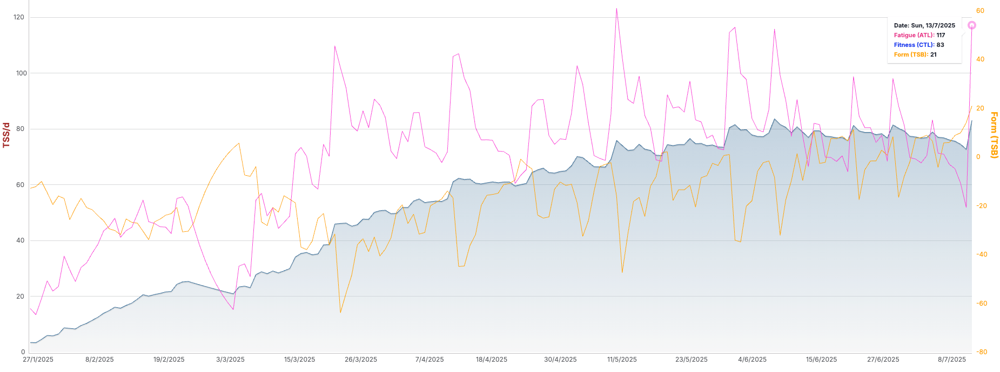

The volumes required to become race-ready involved 2162km on the bike, 470km running, 64km swimming and 11h of cross-training.

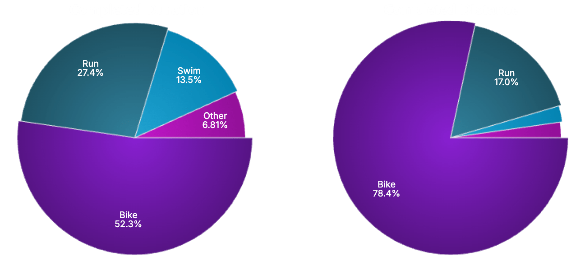

The key differences to last year's training plan were:

- using the Garmin watch to follow the structured plan during live workouts, which was much better than the apple watch I used in 2024 (plan wise and battery wise).
- more social training:
    - running with my sister
    - riding with friends for fast laps around Regents Park and Richmond Park and on long centurion rides (+100k bike rides)
  
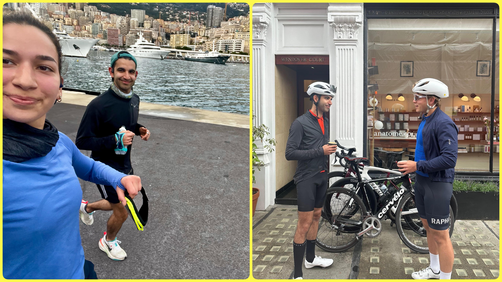

- no longer listening to music when biking or running alone
- more open water swims (5 sessions this year VS only 1 last year)

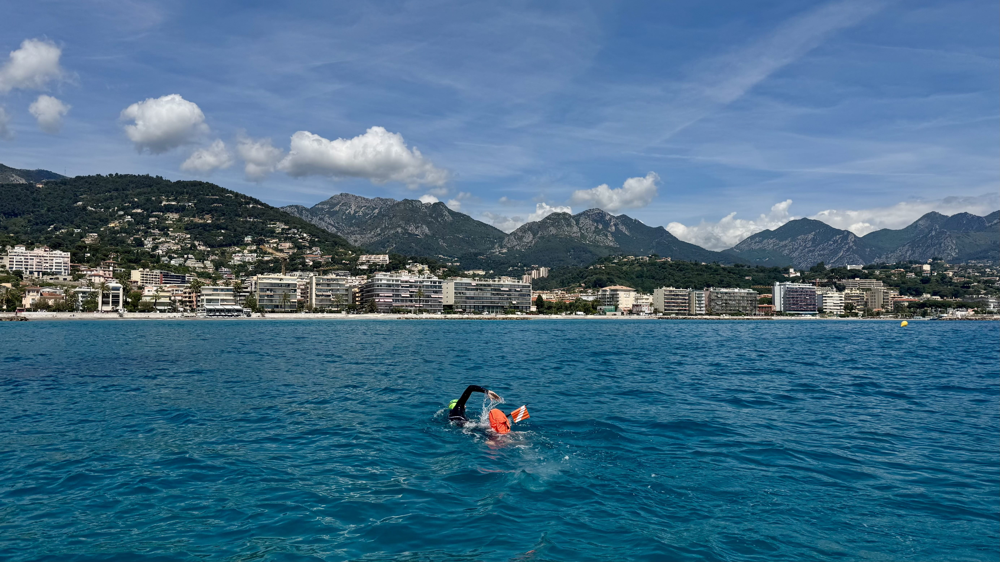

- being more prepared for bike issues. I learned more about my bike in general, and learned how to fix most issues. I also purchased all the gear needed on me for the race to quickly fix bike punctures (electric pump, sturdy levers and TPU spare tube). Before the race, I practiced replacing the inner tube quickly by training on my old tires, and get familiar with the process and the tools used.

At this point, in terms of energy, mental, strength and experience, I was ready for the race.

---

# Pre-race

I travelled to Swansea the day before the race to check in, rack the bike and setup transition bags. Everything was very smooth and I was super relaxed, just having a good time! Because a heatwave was hitting the country that weekend, I adapted my hydration to take in more electrolytes.

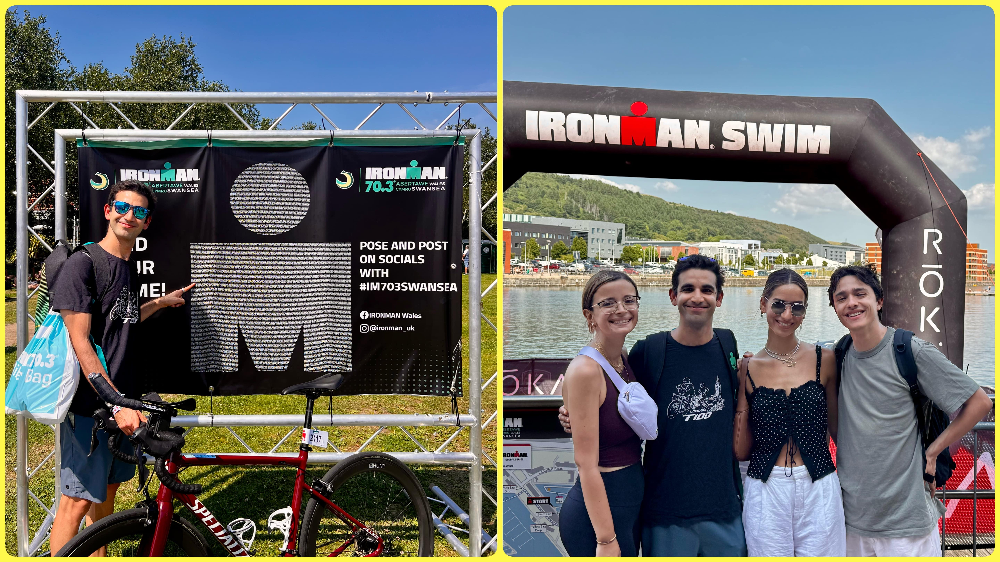

The morning of the race I did final preparations, cleaned some bird poo off the bike (spoiler: it did not bring me good luck), and set off!

---

# Race

### Swim

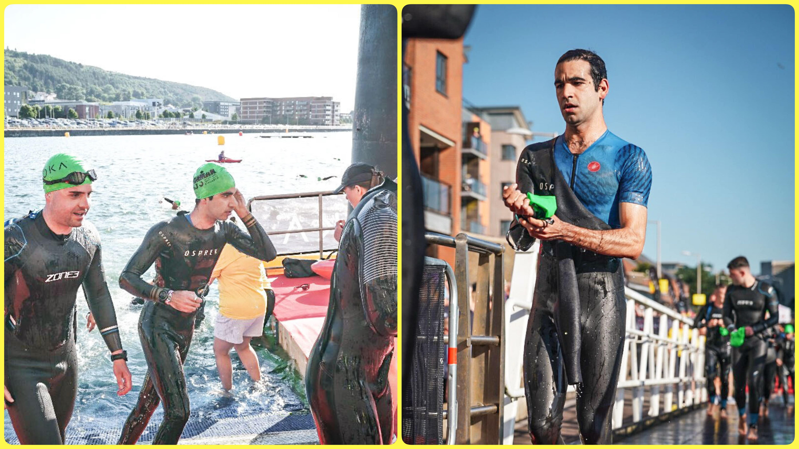

The swim took place at the Prince of Wales Dock, where the water was just over 24 degrees Celsius, which made it almost wetsuit illegal (never would have thought this was a possibility for a race in the UK).

The swim itself went smoothly, I enjoyed all of it, and managed to get in a rhythm despite some obstacles, such as swerving off course twice, contact with other competitors and some jellyfish.

Overall, I was extremely happy with the swim, coming out feeling good and with a 39:35 swim, which put me under my target time!

Check out the Strava below for more details and pictures:

---

### T1

Coming out of water I felt great and ran the whole transition to the bike. The run was about 800 meters over cold rocky tarmac. So I followed a tip from the local athletes to put shoes in my optional T1 bag (cold feet + sharp stones = pain). I also took water and a banana to quickly refuel before jumping on the bike. 

Overall this was a smooth transition, which lasted 8:45, and allowed me to carry over the high from the swim.

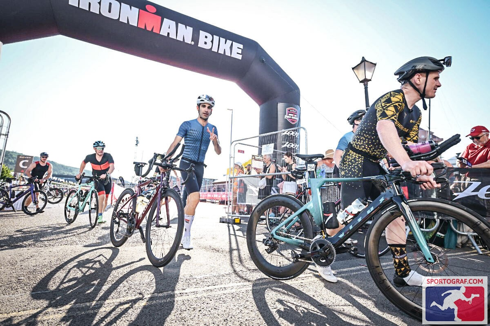

---

### Bike

After setting off and moving my nutrition from the bike frame to my back pockets, I put the hammer down. The first 10k were flat so I pushed in the TT position. Then most of the hard hills came in the first 30k, for which I was feeling great, pushing hard on each hill, overtaking a lot of competitors. It took me 1h to cycle 30k, so I was proud, and still on target for a sub-3h ride.

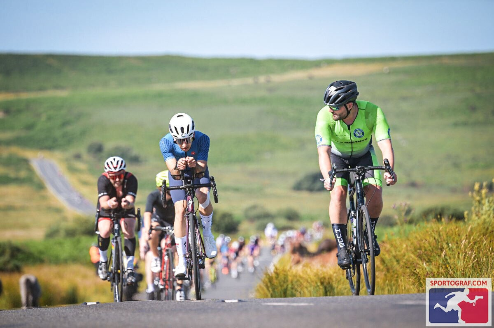

I was nervous about using the aid stations as it was my first time using them on a bike course. Luckily, I had no problem grabbing water bottles (only dropped one). I was able to remain consistent and hit my target of about 60g of carbs per hour (energy gels), and in total drank 4 bottles of water (3 with electrolytes, 1 still) over the bike course to keep hydrated in the heat.

Then the first hurdle came. At around kilometer 50 out of 90, when tackling the second loop, I was met with some serious headwind, as well as some crosswind on downhills, making the bike very unstable. Unfortunately, it affected me a lot mentally, as I was pushing hard but couldn't get back to speeds above 27-30 kph on the flats. This, plus some slowly increasing lower back pain from being in the TT position for too long, started mentally draining me. I could see the time slowly slipping away from me and knew a sub-6h was getting hard to achieve, but it was still do-able if I finished the bike in 3h10m and ran a sub-2h half-marathon.

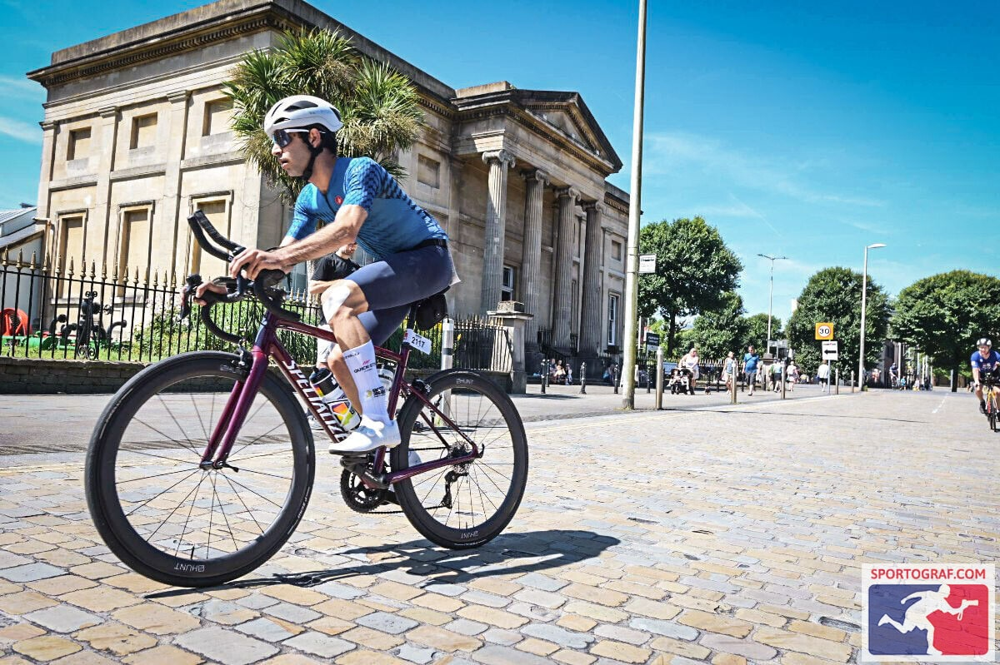

Then at kilometer 70, I was hit with some serious bad luck. The chain fell while I was climbing hill #11/12, and it got stuck between the two gears in the front derailleur. It took a while to dislodge it and put the chain back as it had never happened to me before, and I lost about 7 minutes fixing this issue (I can now fix this in less than 30 seconds, but I the mix of adrenaline rush and stress meant I took a long time to figure out how to dislodge it during the race). Once I got back up on the saddle, I knew the sub-6h was impossible. I still tried my best to keep pushing, but I was thinking about the upcoming half-marathon and saving my legs.

Check out the Strava below for detailed data like speed or heart rate and more pictures:

---

### T2

Arriving back to Transition, I was mentally tired. But I saw all my support crew: my partner, my sister and my friends, each cheering me on at different parts of the transition, telling me to push and that I got this. They didn't care that I didn't hit my sub-3h goal on the bike, they came all this way to support me. And I decided that neither did I. And at that moment, when exiting transition, I made the decision to push for my sub-2h half-marathon goal.

---

### Run

This was the most mentally-draining 2 hours of my life. The course were 2 loops of the Bay of Swansea, back-and-forth along the beach. I could see the people coming back from the end of the bay towards the towncentre, and all I could think about was when the turning point would be. I knew it would be about 5km away from the start, but I started anticipating it around the 2nd kilometer. And the 3 remaining kilometers to that turning point of the loop were gruelling. What caught me by surprise was when I reached the turning point to head back, and saw just how far Swansea was. This was mentally hard to accept. I started picturing the run back to close loop 1, then heading back out again for loop 2, just to repeat the 5k stretch I was about to begin. The combination of my aching legs and those mind tricks really affected me. I just wanted to stop and walk for a bit.

But I knew this was a trap.

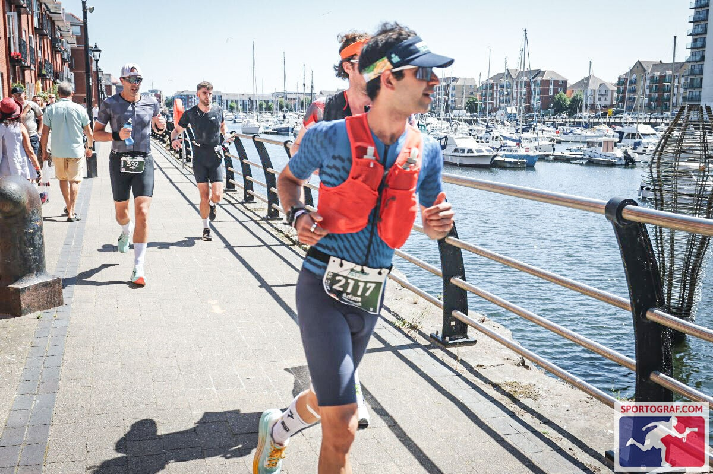

I decided this was the key moment of the race for me. If I allowed myself to walk just once, my mind would then tell me it's OK to walk whenever I felt tired, and the sub-2h target would certainly fly out the window. So I picked someone in front of me that looked fresh and who was going the pace I needed to do (about 5m30s/km) and just followed them. I followed them for the rest of the race. Luckily they were great at keeping that pace, and I just stayed with them no matter what, not even stopping at the aid stations, just drinking my own water and stomaching my remaining gels.

After what felt like an eternity, I reached the final kilometer, which is marked by a sign that says "to the finish", standing right next to the "lap 2 sign". I then looked at my watch and saw I had about 8 minutes to run the final kilometer to finish sub-2h. 

I had done it.

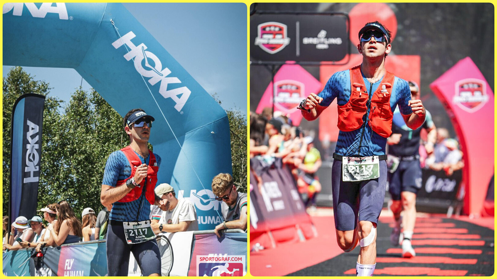

I took the moment in, and really enjoyed the final stretch. I reflected on how far I'd made it, the 6 months of hard, regular training, the waking up early before work to go swim, the eating well, the long rides and the long runs on the weekends, the sacrifices made, and the constant learnings. I was excited to reach see everyone at the finish line, standing around the red carpet. When I reached the final bit, two of my friends were there and shouted at me me to sprint it. I had some energy left, maybe from the adrenaline, so I went for it as hard as I could. Looking back at a video of me running the red carpet, I didn't look that fast, but I remembering feeling like the Flash in that final straight.

Strava for my pacing during the Half-Marathon:

---

### Finish-line

Taking the finish line was such a great feeling. Instant relief and pride are the only way to describe it. I took a moment to soak it in, then walked over to grab my medal and hug my support crew.

And that was it.

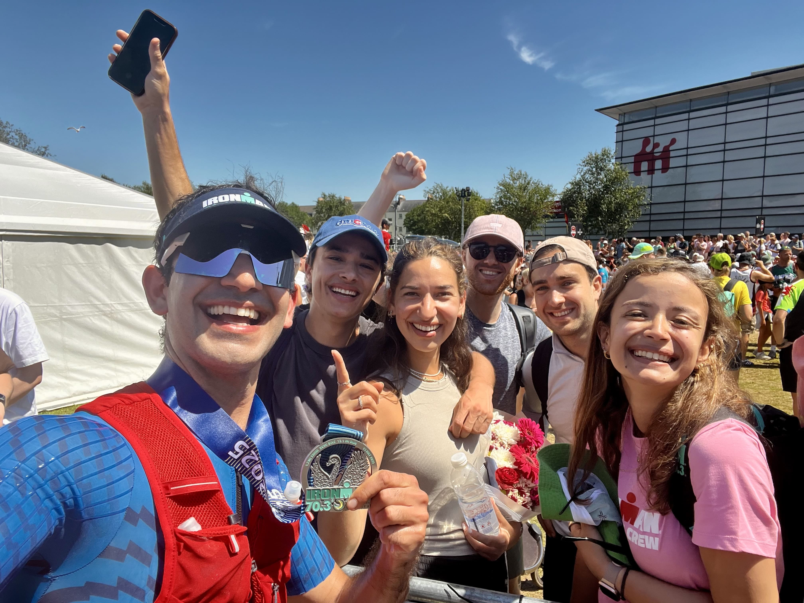

We then carried all the battle-worn gear and the bike out of Transition, and headed for a nice heavy lunch with everyone (my stomach was still upset from all the gels, but I was still starving and needed some serious calories).

---

# Post-race learnings

Here are some disorganised, but still valuable, post-race learnings:

- Living in London, I really need a race with a flatter bike course next time. If I want to stay local to the UK, London T100 or Weymouth 70.3 would be the best bet (although not flat), or I could travel to other races. One that caught my eye was Turkey 70.3 for 2026.
- Nutrition and hydration was spot on, I never bonked out and never felt thirsty. In total, I drank 5 bottles of water (4 of them with electrolytes), ate 9 gels (ranging from 23-40g of carbs, 2 of them with caffeine for the run segment). For future races, I would love to learn more about nutrition in general, and calculate the exact sodium intake (in mg/h) required for my effort, as well as my exact carbs (in g/h) for next race as well to use estimates (although they did work for this race).
- My cheap wetsuit has finally reached end of life. It feels too tight and restrictive, and is starting to tear. It's time to invest in a new wetsuit (maybe that will motivate me to do more open water swimming?)
- Start taking some swimming lessons, both indoor ones for my technique, and a few triathlon ones to translate that speed I gained in the pool to the open water.
- I had an "emergency tire fixer" in case I got a puncture in the final stages of the race (to avoid changing an inner tube if there were less than 15 kilometers left). I had in my backpocket, which fell once when running out of Transition 1, and that I forgot to remove for the run. It's definitely worth attaching it on the bike rather than keeping it in the rear pocket for the whole race.
- I need to find a solution for making my knee tape stick on the run. I've had knee injuries since 2022, and a physio fixed it in 2024 before my first triathlon at the [London T100 Olympic Triathlon](https://adamouization.github.io/2024/07/28/first-triathlon/). But part of the solution was using knee tape for each run. And running this half-marathon distance without it (I tried sticking 5 strips but they never stayed for longer than a kilometer due to the sweat/sea salt on my skin) really hurt my knee, and I have not been able to run for 2 weeks following the race.

# Next challenges and goals

For 2025, my next goals are:

- Beat my [London T100 Olympic Triathlon](https://adamouization.github.io/2024/07/28/first-triathlon/) time of 2h57. My target is to complete it in under 2h45 at the Dorney Lake Olympic Triathlon in September.
- Run a sub 1h50 half-marathon.
- Maintain my fitness over winter.

Longer term, my goals are:

- A sub-6h IronMan 70.3
- Eventually, a full-distance IronMan 140.6.

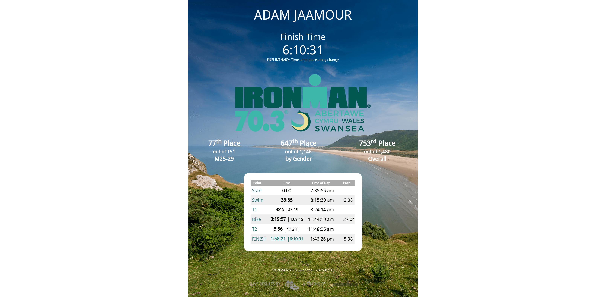