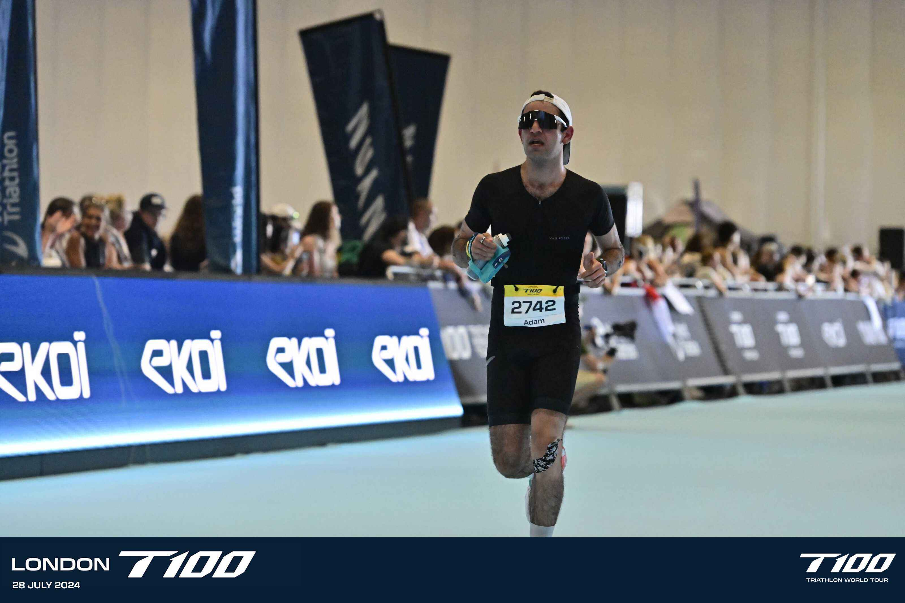
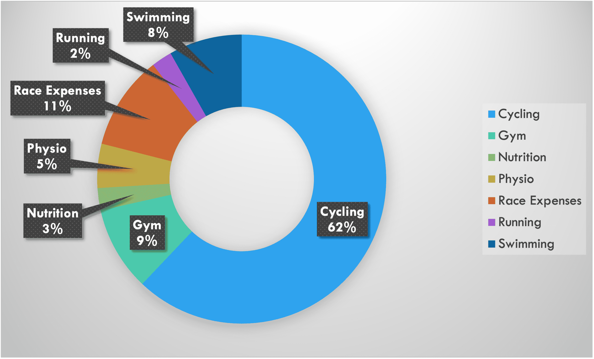
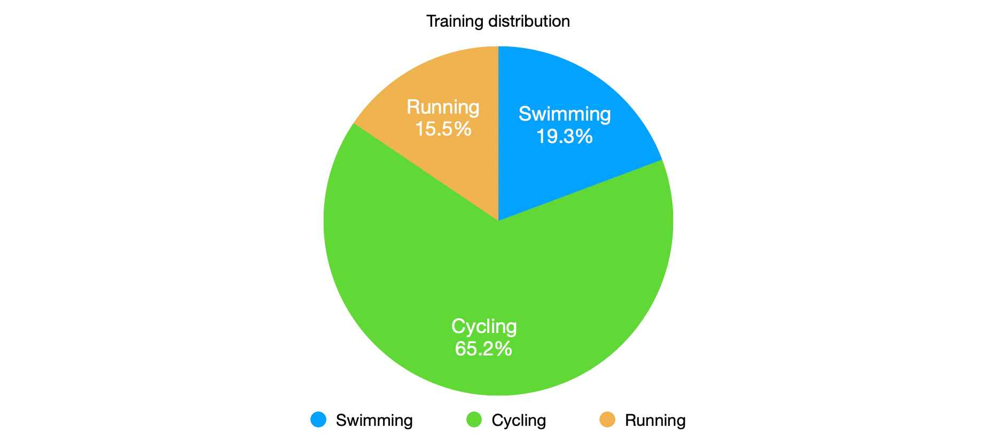
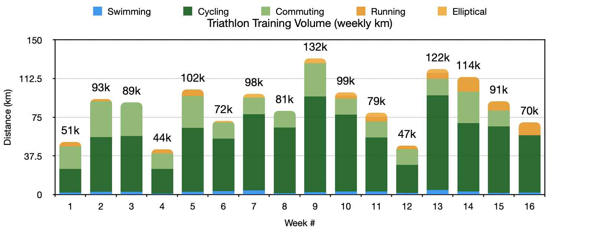
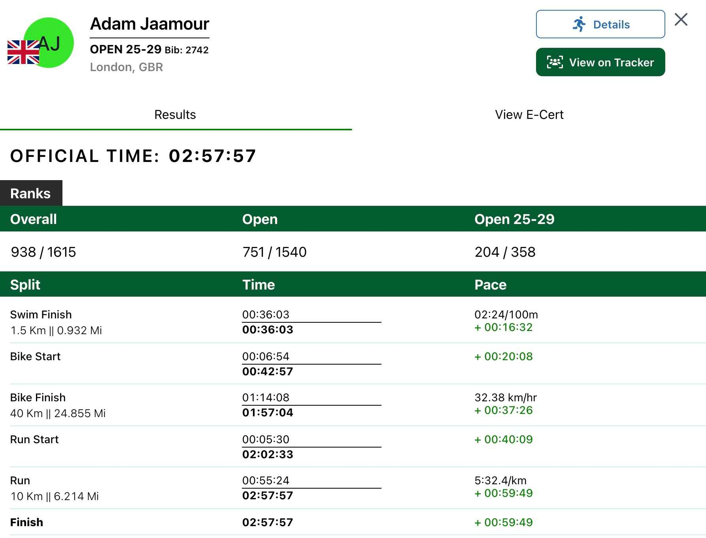
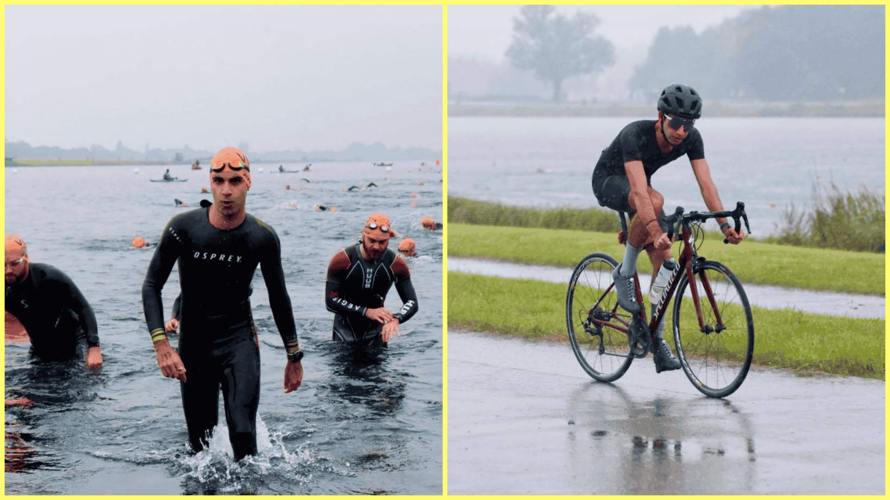

Earlier this year, I set myself the goal of tackling a triathlon, despite being a terrible swimmer and cyclist, and having only completed a single half-marathon so far. Read more about my journey below.

<!--more-->

# Motivation

Despite training for a couple of half-marathons (one in 2022 and one in 2023) and picking up knee injuries along the way, I wanted to find a new way to challenge myself that didn’t involve only running. So, another half-marathon, or even a full one, were out of the question.

When brainstorming what new challenge I could chase, I thought about an old goal I had of one day completing a full-distance IronMan (140.6 miles). But that would not have been a wise choice given the enormous volume of training required to complete this kind of event coupled with my lack of experience in this sport. So I researched shorter-distance triathlons, and settled on the Olympic distance as it seemed to be right balance of challenge.

Additionally, I saw this as the perfect opportunity to strengthen my body (and my knee), increase my fitness (which would translate to faster running), and learn new sports that I have always put off.

So I signed up for the biggest triathlon in London: the olympic distance triathlon at the inaugural 2024 T100 race, which entails a 1.5km swim, a 40km bike ride and a 10km run.

# Goals

I set myself the two goals:

1. Complete and enjoy the triathlon pain-free
2. Complete the triathlon in under 3 hours

# Budget

Now everyone knows triathlons require a budget from all the gear, pool access and race fees.

I “tried” to keep a tight budget with the goal of not exceeding £1500 total, including race sign-up and mandatory gear such as bike and wetsuit.

Thankfully, I already had all the running gear I needed. What I needed was some basic biking gear. So I bought a second hand road bike off Ebay and some cycling gear from Van Rysel (Decathlon’ brand, a great value for money in my opinion to not splash on brands like Rapha or Le Col at first). I also needed the basics for swimming (access to a pool via a gym membership, swimwear, a cap and goggles).

I re-used as much as I could at first, including my cycling commuting helmet, my phone as a bike computer / GPS, my apple watch for workout tracking, and some old gear that friends gave me.

With the above taken of, I found a free 4-month training plan and started executing it in March 2024!

Remember how I initially said that I “tried” to remain within budget? Towards the end of the training, I splashed on some extra gear that is not necessary for a first triathlon, but that I really wanted to enhance the experience, such as bike computer with sensors, and extra cycling gear.

Here is the total rundown of the costs in a pie chart, confirming that cycling is by far the largest expense.

# Training

Training has gone really well, as I never felt burned out and enjoyed most of the training sessions (except a few long and early swimming pool sessions and some wet bike rides), only missing 2 sessions in total! I suspect this wouldn’t have been the case if I had immediately tackled a 70.3 or 140.6 IronMan distance.

The worst part of the training was that I had to replace runs with some elliptical/treadmill sessions while I was working on my injured knee with a physiotherapist. I was only able to re-introduce running in the last month of training. Although I initially despised the elliptical as I missed running outdoors, I found a compromise by setting the rule that I could only watch Netflix’s Tour de France docuseries while training on the elliptical. Watching Vingegaard and Pogacar fight it out served as a great motivator to not skip any of these sessions.

Most of the training sessions were done solo, but I did enjoy a couple of rides, swims and runs with friends. I did find that I like training on my own.

The main benefit I got from those training sessions is the discipline that I learned. I planned for +80% of the workouts to be early in the morning before work or some weekend activities, which was hard at times as some days this required waking up at 5:30am.

I ended up training 85 hours in total, of 65% was spent on a bike, 20% in a pool, and 15% either running or on the elliptical.

In total, that equated 41km swam, 1252km ridden (929 on road bike and 323 commuting) and 90km run (21 elliptical and 69 actual running).

Additionally, I kept track of some key metrics for swimming and for cycling to visualise my improvements across time, which was extremely encouraging to see as I could witness myself improve every week!

Overall, I was feeling more than physically and mentally ready for the race as I had all the gear I need, I had a large list of tips from my  friends with triathlon experience, I was familiar with the whole race route, and I got support all along the way!

# Race Day

The pre-race went smoothly as I used all the tips I could to prepare. So I carbed up the whole week before the race, set up my bike and transition bags the day before the race, and made my way to transition on race day. Before the race, I prepared my trisuit/wetsuit with some oil for easy removal and to avoid chaffing, ate a banana and had a gel right before going in.

## Swim

The 1500 meter swim in the [Victoria Docks](https://www.visitlondon.com/fr/que-faire-a-londres/endroit/36056257-royal-victoria-dock) went OK, but I was disappointed as I completed it in 36 minutes, averaging 2:24/100m, which is the same pace as all my other open water swims. I had initially hoped for a swim around the 30-minute mark, but overall I had only lost 6 minutes which wasn’t the worse scenario.

In retrospect, two factors that affected me was that I had extremely leaky goggles and that I was turning my head very high up to avoid drinking some Thames water by accident, causing my legs to sink a lot. But I felt physically good at the end, and enjoyed the positive experience.



 


## Transition 1

I had been kicking hard for the last 50-100 meters to avoid stiff legs from the cold water and lack of exercise, so I felt fine out the water. I easily removed my wetsuit, took a few seconds to high-five friends and family who were cheering me on, and ran all the way to the bike. It was a smooth transition into cycling with no mistakes made as I had rehearsed it.

This was a very long transition due to the layout of the Excel, which forces triathletes to run upstairs and then all around the transition area, adding a good 700 meters of race distance barefoot! But it’s the same for everyone so it’s fair.

## Bike

The 40km bike ride took us from the Excel all the way to central London by Big Ben.

I had a plan to maintain 30 km/h average speed with ~90 rpm cadence throughout the whole course, which I could accurately track with my bike computer and sensors. What I didn’t expect was to be able to maintain 32.28 km/h average speed throughout the whole course as I was thankfully feeling full of energy. Once I noticed that I was going much faster than I had hoped, I did some mental calculations and realised a sub-3 hour triathlon was actually possible as I had made up more than 15 minutes from my target, which offset the slow swim!

The ride itself was beautiful, I had a lot of support on the track again, I was overtaking many people, the weather was beautiful, and I was able to take a gel and drink a lot during the course’s flat bits. It felt like the training had really come to fruition on this course!



 


## Transition 2

I got off the bike smoothly and knew I could take it easier than I had hoped as I had just a little over 1h to complete a 10k. I ran back to transition, racked my bike, took my final gel, drank a lot and applied some k-tape on my knee to avoid the old injury flaring up.

The run and my knee injury were big question marks as I had not run a 10k in over half a year, and never gone above 5k in my training. So the thought of a looming injury was in the back of my mind throughout most of the race as I had already DNF’d a race in 2022 due to this.

## Run

The 10k run took us across a 2.5k loop around the Excel by the water, making it a lovely run with constant support from the crowds. My initial goal was to just finish it in under an hour (pace of 6:00/km), but knowing that the sub-3 goal was achievable gave me a massive adrenaline boost.

After completing the first loop without looking at my watch and just racing, I saw I was running much faster than anticipated. On the one hand, this scared me as I had fallen in the trap my friends warned me about of overdoing it off the bike and burning out before the end of the race. But on the other end, it also re-assured me as I could slow down to a pace of 5:40-6:00/km, focus on form to not trigger my knee injury, and just bring it home. Looping next to the finish line three times was a great motivator as I kept seeing my friends and family shouting my name.

After the last loop, I finally took the finish line, soaked in the final sprint’s atmosphere, and clocked in at 2h57m57s!



 


# Post-Race

I was incredibly happy to finish in sub-3h, despite the transition’s layout which cost me a total of 12m24s. I truly didn’t expect it at first, and was incredibly proud of all the training and the race I had done. The race was truly the reward for 4-months of training.

I still felt good after the race, and had thankfully planned everything perfectly to leave shortly after in a clean set of clothes so I could enjoy some food and drinks with all those who came to support me.

I genuinely loved triathlon training/racing so much that I will likely compete in another one in September (Sprint distance at the Dorney Triathlon, which is half the Olympic distance), and will probably set new goals for myself for 2025 (either a 70.3 IronMan or an Olympic distance but with a faster time).

September 2024 Update: I have completed my second triathlon at the Dorney Lake  (see picture below). It was a sprint distance, and despite the fact that it was pouring and freezing for most of it, I had a great time and finished in 1 hour and 28 minutes! Onto 2025…

